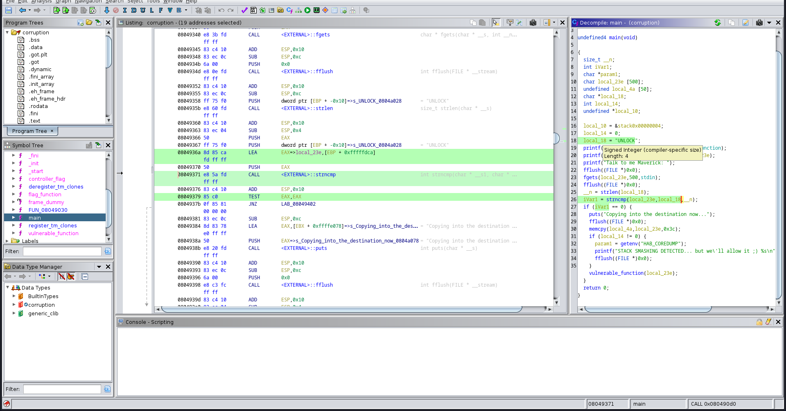
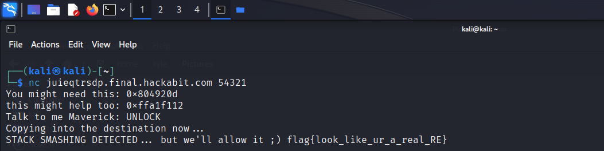

## Challenge ~
Now that we have at least inspected the binary, lets go a bit deeper. You can't just overflow the buffer with a bunch of A's--reverse engineer the software and figure out your payload format. Smash the stack to get the flag, no control necessary yet. Once you have a working exploit, fire it against the remote target to get the real flag.

All challenges in this section use the same binary. The target is x86 and ASLR is on but it shouldn't be relevant to any of your exploits.
<br>

<b>juieqtrsdp.final.hackabit.com:54321</b>
<br>
- [Corruption](../Assets/Downloadable/corruption)


## Solution ~
This time for this challenge, we have to get the code pieces in this file to solve the challenge. First step is to use your favorite reverse engineering tool, I used Ghidra. Next, let's go into the main function area to see what we can get out of this.

<br>

```c
undefined4 main(void)

{
  size_t __n;
  int iVar1;
  char *param1;
  char local_23e [500];
  undefined local_4a [50];
  char *local_18;
  int local_14;
  undefined *local_10;
  
  local_10 = &stack0x00000004;
  local_14 = 0;
  local_18 = "UNLOCK";
  printf("You might need this: %p\n",flag_function);
  printf("this might help too: %p\n",local_23e);
  printf("Talk to me Maverick: ");
  fflush((FILE *)0x0);
  fgets(local_23e,500,stdin);
  fflush((FILE *)0x0);
  __n = strlen(local_18);
  iVar1 = strncmp(local_23e,local_18,__n);
  if (iVar1 == 0) {
    puts("Copying into the destination now...");
    fflush((FILE *)0x0);
    memcpy(local_4a,local_23e,0x3c);
    if (local_14 != 0) {
      param1 = getenv("HAB_COREDUMP");
      printf("STACK SMASHING DETECTED... but we\'ll allow it ;) %s\n",param1);
      fflush((FILE *)0x0);
    }
    vulnerable_function(local_23e);
  }
  return 0;
}
```

<br>

As we can see in the function, the value `local_18 = "UNLOCK";` is the first check for the if statement `(iVar1 == 0)`. This happens because of the string compare right above. `strncmp` will compare our input to `"UNLOCK"`, find the difference, and return 0 if true to the value of `iVar1`.

<br>



<br>

Now we run the script with UNLOCK on the host given to us in the challenge:

<br>



<br>

With the give 🚩 <b>flag{look_like_ur_a_real_RE}</b>
