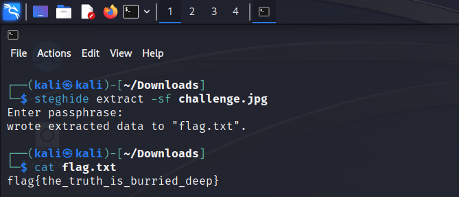

## Challenge ~
There is a challenge hidden in coverup.jpg, extract the flag and profit.
<br>

- [Challenge.jpg](../Assets/Downloadable/challenge.jpg)


## Solution ~
This challenge is was very interesting to say the least. My first thought was to see if the challenge had any interesting EXIF data but was provided with nothing:

```
ExifTool Version Number         : 12.57
File Name                       : challenge.jpg
Directory                       : .
File Size                       : 360 kB
File Modification Date/Time     : 2023:05:21 09:29:10-05:00
File Access Date/Time           : 2023:06:04 17:12:13-05:00
File Inode Change Date/Time     : 2023:05:21 09:29:10-05:00
File Permissions                : -rw-r--r--
File Type                       : JPEG
File Type Extension             : jpg
MIME Type                       : image/jpeg
JFIF Version                    : 1.01
Resolution Unit                 : None
X Resolution                    : 1
Y Resolution                    : 1
Image Width                     : 1024
Image Height                    : 1024
Encoding Process                : Baseline DCT, Huffman coding
Bits Per Sample                 : 8
Color Components                : 3
Y Cb Cr Sub Sampling            : YCbCr4:4:4 (1 1)
Image Size                      : 1024x1024
Megapixels                      : 1.0
```

I then thought that this image might have some steganography put on it. I used <a href="https://steghide.sourceforge.net/">steghide</a> and the following command, `steghide extract -sf challenge.jpg`. The program does ask for a password, however, none was needed and if there was a password then steghide would try to crack it.

<br>



<br>

🚩 <b>flag{the_truth_is_burried_deep}</b>

