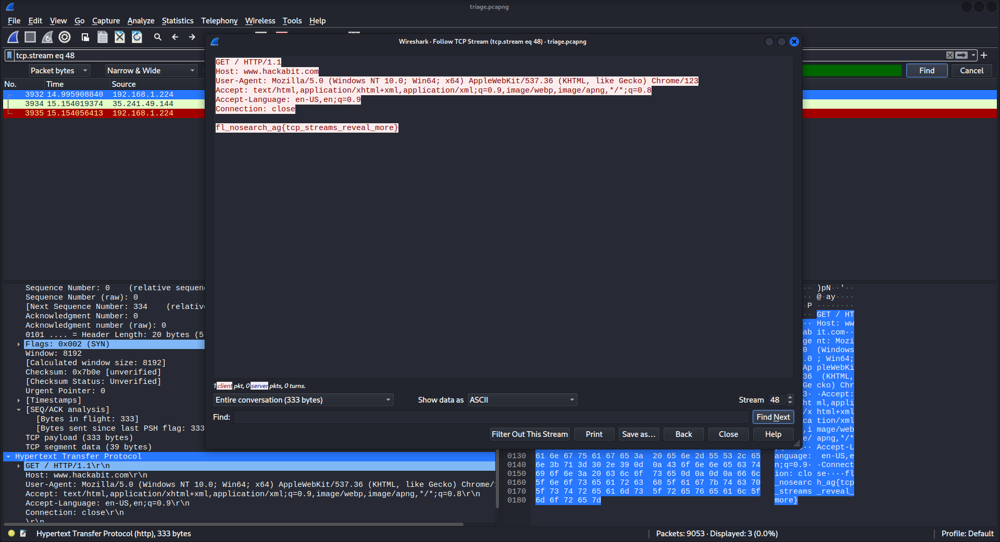

## Challenge ~
It's just a simple stream challenge, how hard can it be?

Both challenges for this section use the same pcapng file.
<br>

- [Triage.pcapng](../Assets/Downloadable/triage.pcapng)


## Solution ~
This challenge had we stumped for a little bit. My initial thought was to go through the TCP and HTTP streams, which only TCP was correct. There were about 500+ packets and I went through each and every one of them until I got the challenge's flag:

<br>



<br>

What I didn't realize about this challenge was to find specific communication points. For instance, finding `final.hackabit.com` TCP targets would have been a start. Also, in the flag's description, TCP reveals more because of the amount of data they can contain, as was revealed to me by a competitor. This would make it from seeing a HTTP stream like this one:

```
GET / HTTP/1.1
Host: www.hackabit.com
User-Agent: Mozilla/5.0 (Windows NT 10.0; Win64; x64) AppleWebKit/537.36 (KHTML, like Gecko) Chrome/123
Accept: text/html,application/xhtml+xml,application/xml;q=0.9,image/webp,image/apng,*/*;q=0.8
Accept-Language: en-US,en;q=0.9
Connection: close
```

To seeing a TCP stream like this one:

```
GET / HTTP/1.1
Host: www.hackabit.com
User-Agent: Mozilla/5.0 (Windows NT 10.0; Win64; x64) AppleWebKit/537.36 (KHTML, like Gecko) Chrome/123
Accept: text/html,application/xhtml+xml,application/xml;q=0.9,image/webp,image/apng,*/*;q=0.8
Accept-Language: en-US,en;q=0.9
Connection: close

fl_nosearch_ag{tcp_streams_reveal_more}
```

🚩 <b>fl_nosearch_ag{tcp_streams_reveal_more}</b>
