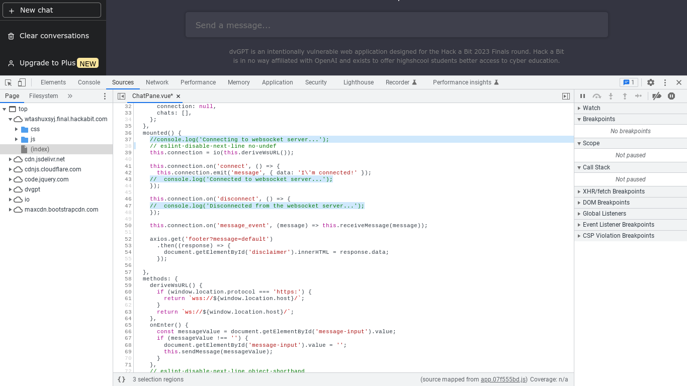

## Challenge ~
People leave dumb comments about vulnerabilities all over client-side code... most modern web applications don't display all the possible code at once though, for a variety of reasons.

https://wtashuxsyj.final.hackabit.com/

## Solution ~
This one might not be as quick as some of the other ones as we might have to look through a lot of the source code. However, when the website loads, if we pull up the inspect tool we can see some console logs that display:
 

`Connecting to websocket server...`
 
`Connected to websocket server...`

 

If we go to the script that displayed this console log we can see an interesting comment:
 

`this.connection = io(this.deriveWsURL());`

 

Which is mainly getting the connection from us, then we see some check statements below. Commenting out this just disables the checks, so that's nice :P, but if we scroll to the top of the script we can see the flag in two different fields as shown below:

 

 

Thus we get the <b>🚩 flag{the_DOM_is_like_crazy_virtual_maaaan}</b>

## Defense
Some of the ways we could prevent a similar situation like this would be to disable/getting rid of debugging features, like console logs, before going into production. In this scenario, there wasn't much of a vulnerability from the debug features, <i>however</i>, if there was, we could keep track of our debug features in a log/checklist file. After this, we go through the list and disable each one.

 

